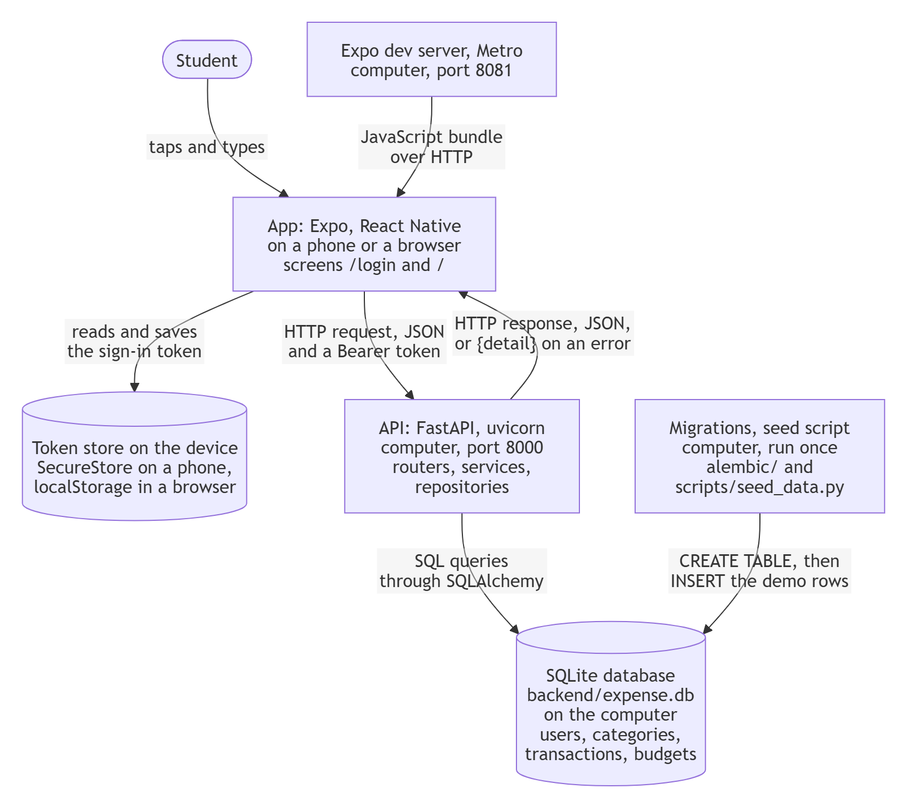
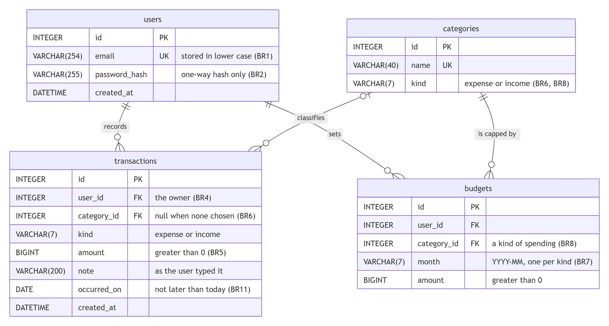
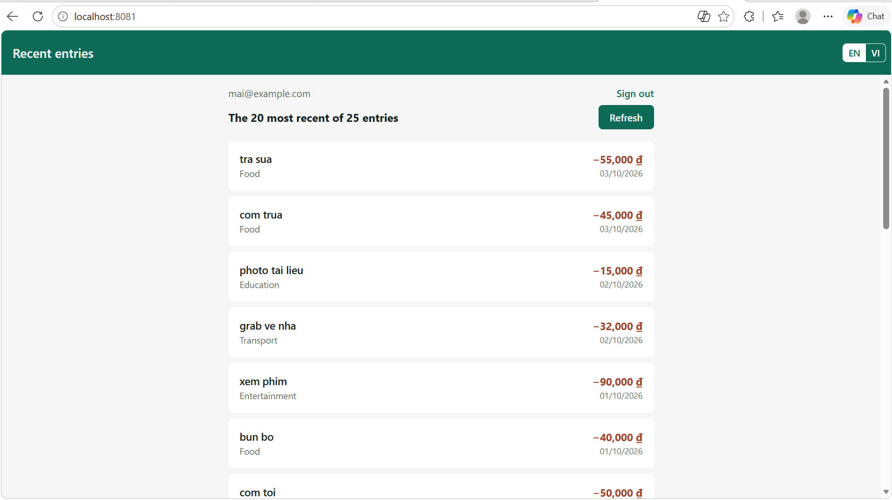

# Design — Personal Expense Management App

**Team 05 · AI66A**
Milestone 2 · Sprint 2 · Weeks 7–8

How the product described in [`docs/requirements.md`](requirements.md) is built, and the walking
skeleton that proves it runs end to end. The install steps for a machine that has never seen the
project are in [`docs/SETUP.md`](SETUP.md).

---

## 1. Architecture

The container level of the C4 model: what runs where, and what travels along each arrow.



Source of the diagram: [`docs/images/architecture.mmd`](images/architecture.mmd).

| Component | Runs on | Technology | Its job |
| --- | --- | --- | --- |
| App | A phone in Expo Go, or a browser | Expo SDK 54, React Native, React Navigation | The screens, in the language the user chose, English or Vietnamese so far (US11); in Sprint 2, `/login` and `/`. It calls the API and never touches the database |
| Token store | The same phone or browser | SecureStore on a phone, localStorage in a browser | Keeps the sign-in token between visits, so the app opens without a password for 7 days (BR10) |
| Expo dev server | The computer | Metro, port 8081 | Sends the app's JavaScript to the phone or the browser |
| API | The computer | FastAPI on uvicorn, Python 3.11 to 3.14, port 8000 | Holds every business rule, behind the endpoints of section 3 |
| Database | The computer | A SQLite file, `backend/expense.db`, reached through SQLAlchemy 2.0 | The four tables of section 2 |
| Migrations and seed script | The computer, once per install | Alembic, `scripts/seed_data.py` | Build the tables, then add the demo data |

No external system takes part: bank sync is out of scope (`docs/requirements.md`, section 1),
and the app sends no email.

**Inside the API, three layers**, each calling only the one below it. The split is what lets
two people build the backend at once without editing the same files.

| Layer | Folder | Owner | Does | Never |
| --- | --- | --- | --- | --- |
| Routers | `backend/app/routers/` | @Chidokato5376 | Read the request, call a service, turn its answer or its error into a status code | Hold a business rule or a query |
| Services | `backend/app/services/` | @Chidokato5376 | Apply the business rules; raise a plain Python error when one is broken | Write a query, or know about HTTP |
| Repositories | `backend/app/db/repositories/` | @nguyennhien2412 | Query the tables, always filtered on the signed-in account (BR4) | Hold a business rule |

Imports point one way only: routers and `app/core/deps.py` import services, services import
repositories, repositories import models. No service imports FastAPI, so every rule can be tested
without a server. The function-by-function contract between services and repositories was agreed
on #60 before either side wrote code, as `docs/process.md` commits to in section 1.

---

## 2. Data model

Four tables, created by migration `0001` in `backend/alembic/versions/` from the models in
`backend/app/db/models/`. CI runs `alembic check` on every pull request, so a model that changes
without a migration turns the build red, and this section cannot quietly drift from the code.



Source of the diagram: [`docs/images/erd.mmd`](images/erd.mmd). Edit that file, then export the
image again.

**Multiplicity.**

- An account records **0..\*** transactions; a transaction belongs to exactly **1** account.
- A category classifies **0..\*** transactions; a transaction has **0..1** category, because BR6
  allows at most one, and none until the user chooses.
- An account sets **0..\*** caps; a cap belongs to exactly **1** account.
- A category is capped by **0..\*** budgets; a cap is on exactly **1** category.

| Table          | Purpose                                                        | Columns and types                                                                                                                                                              | Keys                                                                                               | Constraint · the M1 rule it enforces                                                                                                                                                                                                                                                                  |
| -------------- | -------------------------------------------------------------- | ------------------------------------------------------------------------------------------------------------------------------------------------------------------------------ | -------------------------------------------------------------------------------------------------- | ----------------------------------------------------------------------------------------------------------------------------------------------------------------------------------------------------------------------------------------------------------------------------------------------------- |
| `users`        | One row per account                                            | `id` INTEGER · `email` VARCHAR(254) · `password_hash` VARCHAR(255) · `created_at` DATETIME                                                                                     | PK `id`                                                                                            | UNIQUE `email` with CHECK `email = lower(email)`: one address is one account, whatever its capitals · **BR1**<br>`password_hash` holds a PBKDF2 hash, never the password · **BR2**                                                                                                                    |
| `categories`   | The fixed list: 8 kinds of spending, 3 kinds of money received | `id` INTEGER · `name` VARCHAR(40) · `kind` VARCHAR(7)                                                                                                                          | PK `id`                                                                                            | UNIQUE `name` · CHECK `kind IN ('expense', 'income')` · **BR6**, **BR8**                                                                                                                                                                                                                              |
| `transactions` | One amount of money spent or received                          | `id` INTEGER · `user_id` INTEGER · `category_id` INTEGER, may be null · `kind` VARCHAR(7) · `amount` BIGINT · `note` VARCHAR(200) · `occurred_on` DATE · `created_at` DATETIME | PK `id` · FK `user_id` → `users.id`, deleted with the account · FK `category_id` → `categories.id` | FK `user_id` NOT NULL, and every query filters on it · **BR4**<br>CHECK `amount > 0` on an integer column: no zero, no negative, no fraction of a dong · **BR5**<br>One nullable `category_id`: at most one kind of spending · **BR6**<br>INDEX (`user_id`, `occurred_on`) for the list on `/` · US05 |
| `budgets`      | A monthly cap on one kind of spending                          | `id` INTEGER · `user_id` INTEGER · `category_id` INTEGER · `month` VARCHAR(7) · `amount` BIGINT                                                                                | PK `id` · FK `user_id` → `users.id`, deleted with the account · FK `category_id` → `categories.id` | UNIQUE (`user_id`, `category_id`, `month`) · **BR7**<br>CHECK `amount > 0` · CHECK `month LIKE '____-__'`                                                                                                                                                                                             |

**Two rules the database cannot hold on its own.** BR11, no entry dated later than today, needs
today's date, and SQLite refuses a CHECK constraint that reads it; so the API checks the date
when an entry is saved, and the seed script never writes a later one. BR8, a cap on spending
only, compares two tables, which a CHECK constraint cannot do; the service checks it when a cap
is saved (US08).

**The schema in executable form** is migration `backend/alembic/versions/0001_create_tables.py`.
It matches `backend/app/db/models/` exactly, and CI fails if the two drift apart (`alembic check`).
`python -m scripts.seed_data` applies it on every new machine before seeding, so the database is
always built by a script, never by hand; `alembic upgrade head --sql` prints it as plain SQL.

---

## 3. API design

A REST API over HTTP with JSON bodies, served by FastAPI under `/api`. Its interactive
documentation, generated from the code, is at `http://localhost:8000/docs` once the backend runs.

**Signing in.** `POST /api/auth/login` returns a token. Every other `/api` endpoint expects it in
the header `Authorization: Bearer <token>`. The token names the account and expires 7 days after
sign-in (BR10), so the server keeps no session table.

**Errors.** Every error answers with one sentence, `{"detail": "<message>"}`. The messages are the
exact ones in the acceptance criteria, always in English; the app shows each sentence it knows in
the language the user chose (US11), and any other sentence as it came. The status says whose
mistake it was: **400** a malformed request, such as a missing field or a `limit` outside 1 to
100; **401** not signed in (BR3, BR10); **409** a conflict with what is stored (BR1); **422** a
well-formed request that breaks a business rule, checked in the service (BR2, BR5, BR6, BR8, BR11).

**Paths name things.** Collections are plural nouns and the HTTP method is the verb, so creating
an account is `POST /api/users`. Signing in creates no stored row and fits no collection, so it is
a small sub-resource named as a noun, a login: `POST /api/auth/login`.

| #   | Method | Path                | Input                                                                                                      | Success output                                                                                                                                                            | Error codes                                                                                                                                                                  | Story        | Built in     |
| --- | ------ | ------------------- | ---------------------------------------------------------------------------------------------------------- | ------------------------------------------------------------------------------------------------------------------------------------------------------------------------- | ---------------------------------------------------------------------------------------------------------------------------------------------------------------------------- | ------------ | ------------ |
| 1   | POST   | `/api/users`        | JSON `email`, `password`                                                                                   | **201** · `access_token`, `expires_at`, `user {id, email}`: the new account is already signed in                                                                          | **409** "This email is already registered" _(BR1)_ · **422** "Password must be 6 to 128 characters" _(BR2)_ · **400** "Enter a valid email address"                          | US01         | Sprint 3     |
| 2   | POST   | `/api/auth/login`   | JSON `email`, `password`                                                                                   | **200** · `access_token`, `token_type` `bearer`, `expires_at` 7 days later _(BR10)_, `user {id, email}`                                                                   | **401** "Incorrect email or password", the same for an unknown email, a wrong password and a malformed address _(BR3)_                                                       | US02         | **Sprint 2** |
| 3   | GET    | `/api/auth/me`      | Bearer token                                                                                               | **200** · `{id, email}` of the signed-in account                                                                                                                          | **401** "Please sign in again": no token, a forged one, or one older than 7 days _(BR10)_                                                                                    | US02         | **Sprint 2** |
| 4   | GET    | `/api/transactions` | Bearer token · query `limit`, 1 to 100, 20 by default                                                      | **200** · `items`: the account's entries, newest first, each `{id, kind, amount, note, occurred_on, category {id, name, kind} or null}` · `total`: how many it has in all | **401** "Please sign in again" · **400** when `limit` is outside 1 to 100                                                                                                    | US05 _(BR4)_ | **Sprint 2** |
| 5   | POST   | `/api/transactions` | Bearer token · JSON `kind` (`expense` or `income`), `amount`, `note`, `occurred_on`, `category_id` or null | **201** · the stored entry, in the shape of row 4                                                                                                                         | **422** "Enter an amount greater than 0" _(BR5)_ · **422** "The date cannot be in the future" _(BR11)_ · **422** "Choose a kind of spending from the list" _(BR6)_ · **401** | US03         | Sprint 3     |
| 6   | GET    | `/api/categories`   | Bearer token                                                                                               | **200** · the 11 categories, `{id, name, kind}`, kinds of spending first                                                                                                  | **401** "Please sign in again"                                                                                                                                               | US03         | Sprint 3     |
| 7   | GET    | `/api/summary`      | Bearer token · query `month` as `YYYY-MM`, this month by default                                           | **200** · `{month, income, spending, remaining, count}` for that month                                                                                                    | **401** · **400** "Month must be written YYYY-MM"                                                                                                                            | US04 _(BR4)_ | Sprint 3     |
| 8   | GET    | `/health`           | none                                                                                                       | **200** · `{"status": "ok"}`                                                                                                                                              | none                                                                                                                                                                         | all          | **Sprint 2** |

Rows 1 to 7 cover all five P0 stories. Four endpoints are built this sprint; the other four are
designed now so that Sprint 3 builds against a fixed contract.

**Planned for the P1 and P2 stories:** `PATCH` and `DELETE /api/transactions/{id}` for US06,
answering **404** for another account's entry rather than 403, so its existence is never confirmed
_(BR4)_; `GET /api/categories/suggestions?note=` for US07; `PUT` and `GET /api/budgets` for US08 and
US09, with **422** "Caps apply to spending only" _(BR8)_; `GET /api/stats/breakdown?month=` for
US10.

---

## 4. Walking skeleton

**Route.** `/`, the overview: `http://localhost:8081/` in a browser. It lists the signed-in
account's 20 most recent entries, newest first, each with its amount, note, kind of spending and
date (US05).

**Table.** `transactions`, joined to `categories` for the kind of spending. The seed script writes
**25 rows** for the demo account, so the page shows 20 and leaves 5 out.

**Path of one request.** The page sends `GET /api/transactions?limit=20` with the sign-in token;
`routers/transactions.py` passes it to `transaction_service.list_recent`, which calls
`transaction_repo.list_recent`; SQLite answers, and the rows travel back as JSON, one row on screen
per entry.



**The SQL behind the page,** exactly as SQLAlchemy sends it:

```sql
SELECT count(*) AS count_1
FROM transactions
WHERE transactions.user_id = ?;

SELECT transactions.id, transactions.user_id, transactions.category_id, transactions.kind,
       transactions.amount, transactions.note, transactions.occurred_on, transactions.created_at,
       categories_1.id AS id_1, categories_1.name, categories_1.kind AS kind_1
FROM transactions
LEFT OUTER JOIN categories AS categories_1 ON categories_1.id = transactions.category_id
WHERE transactions.user_id = ?
ORDER BY transactions.occurred_on DESC, transactions.id DESC
LIMIT ? OFFSET ?;
-- parameters: (1, 20, 0)
```

The account id in both `WHERE` clauses comes from the sign-in token, never from the request, which
is BR4 in the query itself.

**The rows come from the database, not from the code.** With the page open, change the newest
entry in the database from `backend/`, then press Refresh; the first row now reads "edited in the
database". `python -m scripts.seed_data --reset` puts it back.

```
python -c "import sqlite3; c = sqlite3.connect('expense.db'); c.execute('UPDATE transactions SET note = ? WHERE id = 25', ('edited in the database',)); c.commit()"
```

**Created and seeded by one command.** `python -m scripts.seed_data` runs the migrations, then
writes 11 categories, 1 account and 25 transactions, and prints those counts.

**Settings.** Every setting is listed, with a comment, in the committed `backend/.env.example`:
`DATABASE_URL`, `SECRET_KEY`, `SESSION_DAYS` and `CORS_ORIGINS`. The real `backend/.env` is ignored
by git, and CI fails any pull request that commits a `.env` file. The app needs no settings file;
`mobile/.env.example` explains its one optional value.

**Install steps** for a machine that has never seen the project, with the expected result of each:
[`docs/SETUP.md`](SETUP.md).

---

## 5. Design decisions

Three decisions that shape everything else. Each lists the options we weighed, what we chose,
why, the quality it buys and what it costs, and what would make us change our mind.

### ADR 1 — A SQLite file instead of PostgreSQL

**Options.** PostgreSQL in Docker, which our spike used · PostgreSQL installed on each machine · a
SQLite file.

**Chose.** A SQLite file, `backend/expense.db`, reached through SQLAlchemy and built by Alembic
migrations.

**Why.** The M2 check runs `docs/SETUP.md` on a machine that has never seen the project, and a
failed install fails the milestone. Docker on Windows needs WSL 2, virtualisation switched on in
the firmware, administrator rights and a download of several gigabytes; any one of them missing
ends the check before our code runs. A local PostgreSQL adds a service, a password and a database
driver, and the driver our spike pinned had no ready-built package for Python 3.14. SQLite ships
inside Python, so there is nothing to install. It still enforces every constraint our rules need:
UNIQUE for BR1 and BR7, CHECK for BR1 and BR5, and FOREIGN KEY for BR4 once each connection
switches it on. One student writes about a hundred entries a month, far below what SQLite handles.

**Quality it buys.** Maintainability: one file, nothing to install or keep running, so anyone can
set the project up in minutes. It costs scalability, since SQLite takes one write at a time.

**What would change our mind.** Serving several users from one shared server, where concurrent
writes queue behind SQLite's single writer; or a rule SQLite cannot express as a constraint. Because
the app talks to the database only through SQLAlchemy and every table comes from a migration, the
switch is a new `DATABASE_URL` and a rerun of the tests.

### ADR 2 — One Expo codebase for the phone and the browser

**Options.** A phone-only React Native app · a separate web client next to the phone app · Expo
with its web target, one codebase for both.

**Chose.** Expo SDK 54 with the web target: the same screens run in Expo Go on a phone and as a web
page at `http://localhost:8081`.

**Why.** Both personas use only a phone, so the product is a phone app. SDK 54 is the newest one
our demo phone's Expo Go opens; `docs/changelog.md` (13/08) records why we moved down to it. But
the M2 check opens a route in a browser on the instructor's machine and asks for a screenshot with
the address bar visible, and a second client would double every screen we build. The web target
costs two things, both handled: a browser has no pull-down gesture, so US05 refreshes with a
button (section 6); and SecureStore does not exist in a browser, so there the token sits in
localStorage.

**Quality it buys.** Maintainability: one set of screens and one set of tests for the phone and the
browser. It costs some security in the browser, where localStorage is weaker than SecureStore.

**What would change our mind.** A feature that needs a phone-only module with no web version,
such as scanning a receipt with the camera, while the browser check still matters; or the web
page becoming something real users sign in to, where the token belongs in an HttpOnly cookie
instead of localStorage.

### ADR 3 — PBKDF2-SHA256 from Python's standard library for passwords

**Options.** bcrypt · Argon2 · PBKDF2-SHA256 from `hashlib`.

**Chose.** PBKDF2-SHA256 with 600,000 iterations, a random 16-byte salt per password and a
constant-time comparison, stored as `pbkdf2_sha256$<iterations>$<salt>$<hash>` (BR2).

**Why.** BR2 accepts passwords of up to 128 characters, but bcrypt reads only the first 72 bytes,
so two long passwords sharing their start would both open the account, and bcrypt 5 refuses longer
input outright. Our spike had already moved off bcrypt because of its clashes with passlib, a
wrapper that is no longer maintained, so we dropped passlib as well. Argon2 and bcrypt are compiled
packages: one more download that must exist for the instructor's Python version. PBKDF2 is built
into Python and approved by NIST (SP 800-132), and 600,000 iterations is OWASP's current advice for
SHA-256. On a team laptop a hash takes about 155 ms and a whole sign-in 0.37 s, well inside the
3 seconds of US02.

**Quality it buys.** Security: a copied database does not give the passwords away, and all 128
characters of a password count. It costs performance on purpose, about 155 ms at every sign-in.

**What would change our mind.** A sign-in slower than one second on the demo laptop, or a server
open to the internet, where Argon2's memory-hard design matters more. The scheme name stored with
each hash lets old and new hashes live side by side, each password re-hashed at its next sign-in.

---

## 6. What changed since M1

_Written in #71._
