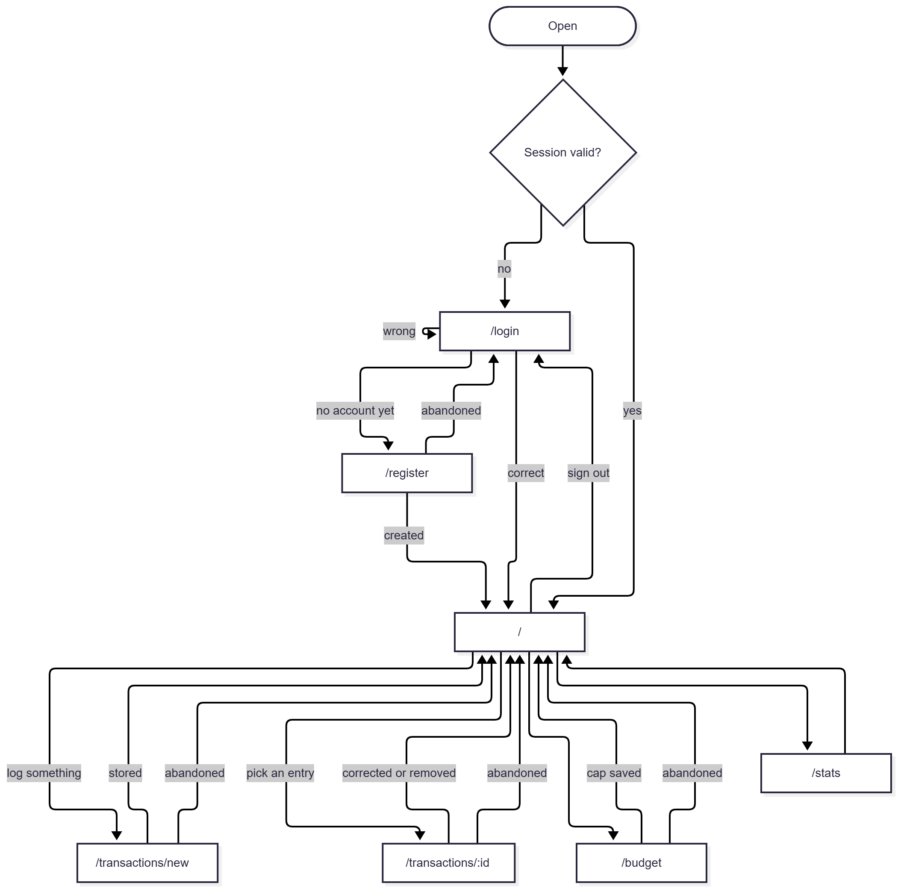

# Requirements — Personal Expense Management App

**Team 05 · AI66A**
Milestone 1 · Sprint 1 · Weeks 5–6

---

## 1. Product vision

For Vietnamese students who live on a fixed amount each month, whether an allowance from family
or wages from a job alongside their studies, and who find out they have overspent only once the money has gone,
the **Personal Expense Management App** shows how much of the month's money is left each time a purchase is written
down, in under 15 seconds, so that a textbook, a jacket or a night out does not quietly use up
the rest of the month. Keeping a notebook is a chore few people keep up, and a banking app lists
transfers but not what was paid in cash.

**Measured by:** one purchase written down in **under 15 seconds**, and the amount left for the
month **visible straight after saving**, with no further step.

**Why we believe this.** From the interviews in `docs/research/interviews.md`:

- All three interviewees keep a limit, whether in their head, as the whole monthly allowance, or
  as separate pots of money, and all three have gone over it at some point.
- Two of the three have never written their spending down. The third relies on an e-wallet's
  monthly list and still overspends a fund now and then.

From the survey in `docs/research/survey.md`, 9 responses:

- None of the 9 knows exactly what they spent last month, and 8 of 9 ran out of money earlier
  than planned, this month or last.
- 8 of 9 pay mainly by bank transfer and 6 of 9 in cash, and cash never appears in a banking
  app's history.
- Asked for the one job an app should do well, 5 of 9 chose knowing what has been spent this
  month and what is left.

From the team's own test of three existing expense apps, in `docs/research/competitors.md`, logging
one purchase took 8 to 31 taps and about 44 to 136 seconds, against the 15 seconds this product is
measured by.

**Out of scope this semester:** automatic bank sync, shared ledgers, currencies other than VND,
PDF report export, and rewards for recording. One interviewee would only use an app that gives
something concrete back; what this product gives back is the amount left, shown after every
entry, not a perk. Caps for a single occasion, such as a trip, are left out too: three of the four survey respondents who set caps set them per occasion, but an occasion has no fixed period for BR7 and BR9 to measure against.

---

## 2. Personas

Both personas come from the three interviews in `docs/research/interviews.md`.

### Persona 1 — The student on a family allowance _(primary)_

**Mai — university student living away from home**

Receives a fixed family allowance of 4,000,000 ₫ per month, spending roughly 3,000,000 ₫ on food and 1,000,000 ₫ on other living expenses. She does not write down what she spends and keeps mental estimates instead, so she often finds out she has overspent only when the money is almost gone before the next transfer.

**Goal:** make her monthly allowance last until the next transfer and know immediately whether a purchase is safe to make.

**Blocked by:** no regular spending record; relying on mental calculations makes it easy to lose track and overspend early in the month.

**In her words:** _"Bởi vì em là một người chi tiêu hơi hoang phí và cũng không hay tính toán lắm, cho nên là nhiều khi nó sẽ có nhiều thứ bị hơi lố."_ (Interviewee 1, 01:47) — "Because I spend rather lavishly and don't calculate much, things often get a bit out of hand."

**Technical context:** phone only, uses it on campus and in her room; never opens a laptop to log daily expenses. The interface has to be fast and work on a small screen.

### Persona 2 — The student who also works _(secondary)_

**Thanh — student and worker, manages shared and personal funds**

Studies and works at the same time. Pays for rent, food, coffee and outings with friends, and everyday necessities. They divide their money into personal and shared funds and use an e-wallet to track spending by category each month. Even with this system, they sometimes spend more than planned and have to take money from savings to cover the difference.

**Goal:** keep each spending fund within its monthly limit without using savings to cover overspending.

**Blocked by:** spending can exceed a fund's limit before they realise it, leaving them to use savings to cover the difference.

**In their words:** _"Tuy nhiên, cũng có nhiều lúc bị tiêu lố và phải lấy khoản tiết kiệm ra để bù vào."_ (Interviewee 2, 02:22) — "Even so, there are many times I overspend and have to take money out of my savings to cover it."

**Technical skill:** regularly uses a mobile e-wallet that automatically categorises spending.

### How the two differ

Persona 1 needs to **see** what is left of a fixed monthly amount with as little effort as possible, because she has no regular habit of recording expenses.

Persona 2 already tracks spending through an e-wallet and separates money into different funds. They need to **control** these funds and avoid exceeding their planned spending limits.

In short, Persona 1 needs **visibility**, while Persona 2 needs **control** over spending limits.

### Interview note

|                           |                                                                                                                                                                                                                                                       |
| ------------------------- | ----------------------------------------------------------------------------------------------------------------------------------------------------------------------------------------------------------------------------------------------------- |
| **Spoke to**              | Interviewee 1, first-year student · 14/09/2026 · 02:00 minutes · by @levanduc36 Interviewee 2, studies and works · 14/09/2026 · 02:30 minutes · by @levanduc36 Interviewee 3, second-year student · 14/09/2026 · 02:00 minutes · by @levanduc36 |
| **Method**                | Open questions about monthly spending, the last time money ran out early, whether they record spending, and any limit they keep. Recorded on video, with spoken consent at the start.                                                                 |
| **Stated limitation**     | Interviewees 1 and 3 were also asked whether they would use such an app. An answer to a hypothetical question is weak evidence, so the personas rest on what the interviewees described doing, not on those two answers.                              |
| **Where the notes are**   | `docs/research/interviews.md`. The videos stay in the team's drive and are not committed, because this repository is public.                                                                                                                          |
| **Cross-checked against** | 9 survey responses, `docs/research/survey.md`                                                                                                                                                                                                         |

---

## 3. Scenarios

### Scenario 1 — The student on an allowance decides whether a jacket can wait

1. On 1 November the student's family sends the month's 4,000,000 ₫, and that evening the student
   writes it down as money received.
2. Each evening before bed they write down what they spent that day, usually about 100,000 ₫ on
   food; each purchase takes a few seconds to write down.
3. After each one they see how much of the month's money is left, without adding anything up.
4. On the 10th they realise they skipped an evening, look back over the last few days, find that a
   45,000 ₫ lunch is missing and add it, checking that nothing has been written down twice.
5. On the 12th a lecturer asks the class to buy a 180,000 ₫ textbook. Before paying, they check:
   2,530,000 ₫ is left for the 19 days until the end of the month.
6. They buy the textbook and write it down, and 2,350,000 ₫ is left.
7. They had planned to buy a 450,000 ₫ jacket that weekend. That would leave 1,900,000 ₫, exactly
   100,000 ₫ a day, which is what they spend on food alone.
8. They put the jacket off until next month's money arrives, rather than go short on meals at the
   end of this one.

### Scenario 2 — The student keeps their entertainment spending within its monthly limit

1. At the start of the month, the student sets a 1,000,000 ₫ monthly limit for going out with friends and records this limit in the system.
2. They record each outing when it happens, including a film, a game night, and a birthday karaoke.
3. By the 18th, after several outings including a 150,000 ₫ cinema trip, their entertainment spending reaches 820,000 ₫.
4. Without being asked, the system tells them that only 180,000 ₫ of the monthly limit remains, while there are still 12 days left in the month.
5. When friends suggest a karaoke outing costing 200,000 ₫ per person that weekend, the student checks the remaining amount and decides not to join because the cost would exceed the remaining limit.
6. On the 30th, they record one final 140,000 ₫ outing, bringing their entertainment spending to 960,000 ₫ for the month, so they do not need to take money from their savings.
7. They review their spending and see that entertainment accounted for 960,000 ₫ of their 4,800,000 ₫ total spending, or 20%.
8. For the following month, they keep the entertainment limit at 1,000,000 ₫.

The amounts in this scenario are illustrative and are used to demonstrate the scenario flow; they are not reported figures from Interviewee 2.

---

## 4. User stories

| ID   | Story                                                                                                                                           | Priority | Points |
| ---- | ----------------------------------------------------------------------------------------------------------------------------------------------- | -------- | ------ |
| US01 | As a new user, I want to create an account with an email and a password, so that my spending stays private to me.                               | P0       | 3      |
| US02 | As a returning user, I want to sign in once and stay signed in, so that logging a purchase is never delayed by a password.                      | P0       | 3      |
| US03 | As someone who has just spent or received money, I want to write it down in seconds, so that I do it before I forget.                           | P0       | 5      |
| US04 | As a user, I want to see this month's income, spending and what is left, so that I know where I stand without adding it up.                     | P0       | 3      |
| US05 | As a user, I want to look back over recent entries, so that I can check for mistakes and duplicates.                                            | P0       | 3      |
| US06 | As a user, I want to correct or remove an entry I got wrong, so that my totals are not skewed.                                                  | P1       | 3      |
| US07 | As someone writing down a purchase, I want the kind of spending suggested from the words I type, so that I do not have to search a list for it. | P1       | 5      |
| US08 | As someone saving money, I want to cap spending on one kind of thing for a month, so that I have a number to stay under.                        | P1       | 5      |
| US09 | As someone with a cap, I want to be told before I reach it, so that I can still change what I do.                                               | P2       | 5      |
| US10 | As a user, I want to see which kinds of spending took the most, so that I know what to cut.                                                     | P2       | 5      |

**Five P0 · three P1 · two P2 · 40 points total.**

---

### US01 — Create an account · P0 · 3 points · `/register`

- Given no account exists for `hoa@example.com`, when the user registers that address with an
  8-character password, then the account is created and they reach the overview **without a
  second sign-in**.
- Given `hoa@example.com` is already registered, when the user tries the same address again,
  then the message reads exactly **"This email is already registered"** and no second account exists.
- Given a password of **5 characters**, when the user submits, then it is rejected with **"Password must be 6 to 128 characters"** and no account is created. _(BR2)_

### US02 — Sign in and stay signed in · P0 · 3 points · `/login`

- Given the correct email and password, when the user signs in, then the overview appears within
  **3 seconds**.
- Given the user signed in and the application was fully closed, when it is opened again **within
  7 days**, then they are still signed in and are not asked for a password. _(BR10)_
- Given a wrong password, **or** an email that was never registered, when the user submits, then
  both cases return exactly **"Incorrect email or password"**. _(BR3)_

### US03 — Log a purchase in seconds · P0 · 5 points · `/transactions/new`

- Given a person who has never used the system, when timing from the moment they begin an entry
  to the moment it appears in their list, then the elapsed time is **under 15 seconds**.
- Given an amount of **55,000** and the note **"tra sua"** (milk tea), when the entry is stored, then the
  month's spending total increases by **exactly 55,000** and the entry is filed under **"Food"**. _(BR6)_
- Given **4,000,000** is entered as money received, when it is stored, then the month's income
  increases by **exactly 4,000,000** and the spending total does not change.
- Given the amount is left empty, or is **0**, or is **−20,000**, when the user submits, then it
  is rejected with **"Enter an amount greater than 0"** and nothing is stored. _(BR5)_

### US04 — This month's position · P0 · 3 points · `/`

- Given income of **4,000,000** and spending of **55,000** and **150,000** this month, when the
  overview loads, then it shows income **4,000,000**, spending **205,000** and remaining
  **3,795,000**.
- Given **3,795,000** is left this month, when an entry of **30,000** is saved, then the overview
  appears straight away showing **3,765,000** left, with no further step.
- Given no entries at all this month, when the overview loads, then it shows
  **"No transactions yet this month"** rather than three zeros.

### US05 — Look back over recent entries · P0 · 3 points · `/`

- Given **25 entries** this month, when the list loads, then the **20 most recent** are shown,
  newest first, each with its amount, note, kind of spending and date.
- Given the phone has no network, when the user refreshes the list, then the message reads
  **"No connection. Pull down to try again"** and the previously loaded entries stay on screen.

### US06 — Correct or remove an entry · P1 · 3 points · `/transactions/:id`

- Given an entry stored as **150,000** that should be **50,000**, when it is corrected, then the
  month's spending total drops by **exactly 100,000**.
- Given the user asks to remove an entry and the question **"Delete this entry?"** appears, when they
  choose **Cancel**, then the entry stays; when they choose **Delete**, then it is removed.
- Given entry id **412** belongs to another account, when this user requests it by id, then the
  response is **"not found"** and none of its content is returned. _(BR4)_

### US07 — Suggest the kind of spending · P1 · 5 points · `/transactions/new`

- Given the note **"tra sua"** (milk tea), when the user finishes typing it, then **"Food"** is suggested;
  given **"shopee"**, **"Shopping"** is suggested.
- Given **"Food"** was suggested and the user changes it to **"Entertainment"** before saving, when
  the entry is stored, then it is stored as **"Entertainment"**. _(BR6)_
- Given the **10 test notes** listed in `docs/research/competitors.md`, when each is processed, then
  **at least 7** suggestions are correct.
- Given the note **"zzz"**, which matches nothing, when the user finishes typing it, then
  **nothing is suggested** and the kind of spending is left empty for the user to choose. _(BR6)_

### US08 — Cap spending for a month · P1 · 5 points · `/budget`

- Given a cap of **3,000,000** on food for this month, when it is saved and the page is opened
  again, then it still reads **3,000,000**.
- Given that cap already exists, when **2,000,000** is saved for food for the same month, then
  there is **exactly one** cap record for food this month and it reads **2,000,000**. _(BR7)_
- Given an income category such as **"Salary"** is chosen, when a cap of **5,000,000** is submitted, then it is rejected with **"Caps apply to spending only"**. _(BR8)_

### US09 — Warn before the cap is reached · P2 · 5 points · `/`

- Given a cap of **3,000,000**, when spending reaches exactly **2,100,000**, 70% of the cap,
  then the amber warning appears; at **2,099,999** no warning appears. _(BR9)_
- Given a cap of **3,000,000** and **2,500,000** already spent, when the overview loads, then an
  amber warning states that **500,000** is left. _(BR9)_
- Given exactly **3,000,000** spent against the same cap, when the overview loads, then the
  warning is still **amber** and states that **0** is left. _(BR9)_
- Given **3,200,000** spent against the same cap, when the overview loads, then the warning is
  red and states **200,000 over**.
- Given no cap has been set, when the overview loads, then **no warning appears at all**.

### US10 — See which kinds of spending took the most · P2 · 5 points · `/stats`

- Given food of **3,000,000** out of **4,000,000** total spending for the month, when the
  breakdown loads, then food is listed **first** at **75%**.
- Given a month with no entries, when the breakdown loads, then it shows
  **"No data yet this month"** and no empty chart is drawn.

---

## 5. Business rules

| ID       | Rule                                                                                                                                                                                                                                   | Worked example                                                                                                                                                                                                                                                     |
| -------- | -------------------------------------------------------------------------------------------------------------------------------------------------------------------------------------------------------------------------------------- | ------------------------------------------------------------------------------------------------------------------------------------------------------------------------------------------------------------------------------------------------------------------ |
| **BR1**  | An email address identifies exactly one account, ignoring capitalisation.                                                                                                                                                              | `TUAN@X.COM` is registered on 12/09. On 13/09 someone registers `tuan@x.com` → rejected as already taken.                                                                                                                                                          |
| **BR2**  | A password is 6 to 128 characters and is never stored or shown as plain text.                                                                                                                                                          | `abc12` (5 characters) → rejected. `abc123` (6) → accepted, and what is stored is a one-way hash of it: no response and no stored field ever contains `abc123`. A password of 129 characters → rejected.                                                           |
| **BR3**  | A failed sign-in returns the same message whether the email is unknown or the password is wrong.                                                                                                                                       | `ghost@x.com` was never registered → 401, "Incorrect email or password". `tuan@x.com`, registered with `abc123`, signs in with `abc124` → the same 401 and the identical message. An attacker cannot tell which emails exist.                                      |
| **BR4**  | An account can read and change only its own entries.                                                                                                                                                                                   | Entry 412 belongs to account 7. Account 9 requests entry 412 → "not found". Not "forbidden", because that would confirm 412 exists.                                                                                                                                |
| **BR5**  | An amount is a whole number of dong, greater than zero.                                                                                                                                                                                | 55,000 → accepted. 0 → rejected. −20,000 → rejected. 55,000.50 → rejected; VND has no subunit in use.                                                                                                                                                              |
| **BR6**  | An entry has at most one kind of spending, chosen from Food, Transport, Shopping, Bills, Entertainment, Health, Education and Other. A suggestion never overrides what the user picks, and when nothing matches, nothing is suggested. | "tra sua" (milk tea) → Food is suggested. The user picks Entertainment instead → stored as Entertainment. "xyz123" → nothing is suggested and the entry is left empty, **not** filed under the most common category, because a wrong guess is worse than no guess. |
| **BR7**  | There is at most one cap per account, per kind of spending, per month.                                                                                                                                                                 | A 3,000,000 food cap exists for 11/2026. Saving 2,000,000 for food 11/2026 replaces the figure; there is still one record, reading 2,000,000.                                                                                                                      |
| **BR8**  | A cap applies only to spending, never to money received: Salary, Bonus or Other income.                                                                                                                                                | Choosing "Salary" and submitting 5,000,000 → rejected. Receiving more money than expected is never something to warn about, so a cap on income has no meaning.                                                                                                     |
| **BR9**  | A cap warns at 70% of the figure and turns to an over-budget warning above 100%.                                                                                                                                                       | Cap 3,000,000. Spent 2,100,000 = exactly 70% → amber. Spent 3,000,000 = exactly 100% → still amber, not yet over. Spent 3,000,001 → over-budget. Both states carry text as well as colour, so they are readable without colour vision.                             |
| **BR10** | A session lasts 7 days from sign-in, then the password is required again.                                                                                                                                                              | Signed in 12/09 at 21:00. On 19/09 at 20:00 the application opens still signed in. On 19/09 at 22:00 it asks for the password.                                                                                                                                     |

---

## 6. Screens and flow

**Access:** `G` guest, not signed in · `U` signed-in user · `A` administrator

| Route               | Purpose                                                                | Access | Priority |
| ------------------- | ---------------------------------------------------------------------- | ------ | -------- |
| `/login`            | Sign in to reach your own records                                      | **G**  | P0       |
| `/register`         | Create an account and enter immediately                                | **G**  | P0       |
| `/`                 | This month's income, spending, remainder; cap warnings; recent entries | **U**  | P0       |
| `/transactions/new` | Log one amount of money spent or received                              | **U**  | P0       |
| `/transactions/:id` | Correct or remove one entry                                            | **U**  | P1       |
| `/budget`           | Set and read monthly caps per kind of spending                         | **U**  | P1       |
| `/stats`            | Breakdown of one month by kind of spending                             | **U**  | P2       |

Seven screens against the required five. **No `A` screen exists this semester:** every account
sees only its own records (BR4), so there is no administrator role to build. This is stated so
the absence reads as a decision rather than an omission.

### Flow

Every screen in the table above appears below and is reachable from `/login`.

Source of the diagram: [`docs/images/flow.mmd`](images/flow.mmd). Edit that file, then export the image again.

**Three things this flow fixes.** No route reaches a `U` screen without a valid session, which is
BR4 expressed as navigation. Every path returns to `/` — both scenarios in section 3 begin and
end there. Creating an account leads straight to `/`, never back through `/login`, which is the
first acceptance criterion of US01.
